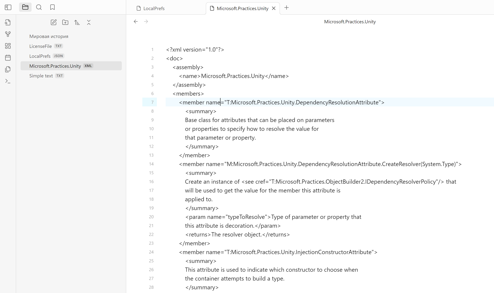

# Obsidian Data Files editor plugin
 

This plugin adds ability to create and edit files of types: `.txt`, `.json`, `.xml` in Obsidian (https://obsidian.md)

## Installation
1. Open Settings > Third-party plugin
2. Make sure Safe mode is **off**
3. Click "Browse community plugins"
4. Search for "Data Files Editor" in Obsidian's community plugins browser
5. Click Install
6. Once installed, close the community plugins window and activate the newly installed plugin

## Usage
### Settings
You can separately enable editing and creation of each type of data file.

### TXT editor

### JSON editor

### XML editor
Doesn't have highlighting yet, will be added in future releases

### File creation
You can create files of each type from the context menu in file tree. If you click on the folder, file will be created inside the folder. If you click on any file, new file will be created on the same level that selected file.

